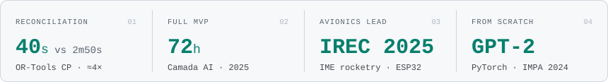
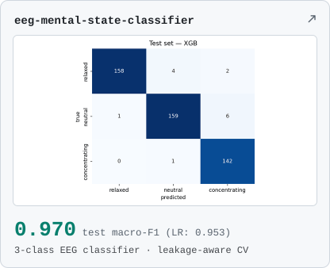
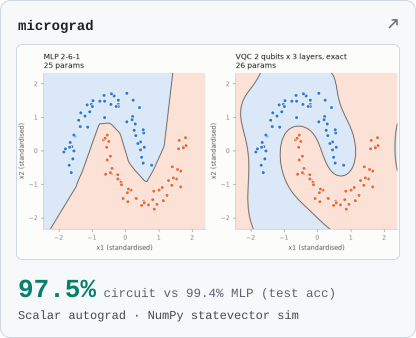
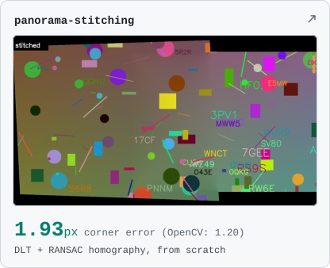
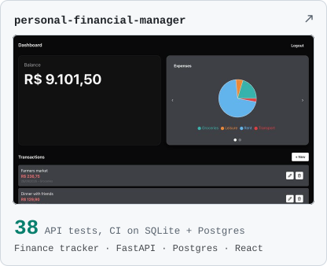

<picture>
  <source media="(prefers-color-scheme: dark) and (max-width: 600px)" srcset="assets/header-dark-narrow.svg">
  <source media="(max-width: 600px)" srcset="assets/header-light-narrow.svg">
  <source media="(prefers-color-scheme: dark)" srcset="assets/header-dark.svg">
  
</picture>

## Shipped

<picture>
  <source media="(prefers-color-scheme: dark) and (max-width: 600px)" srcset="assets/shipped-dark-narrow.svg">
  <source media="(max-width: 600px)" srcset="assets/shipped-light-narrow.svg">
  <source media="(prefers-color-scheme: dark)" srcset="assets/shipped-dark.svg">
  
</picture>

- **Built a bank-reconciliation engine that runs in 40 s; the market incumbent takes 2 min 50 s (≈4×).** Camada AI, 2025. Deterministic, on Google OR-Tools constraint programming, chosen over an LLM after measuring correctness, latency and cost. M:N transaction matching; OFX, PDF, XLS and CSV parsers.
- **Shipped Camada AI's full MVP in 72 hours** (React/TypeScript, FastAPI, Postgres). Also built a multi-agent WhatsApp invoice-automation flow (LangGraph, Whisper).
- **Led avionics for IME's rocketry team at IREC 2025** (Intercollegiate Rocket Engineering Competition). C++ firmware on ESP32 with a Kalman filter.
- **Wrote GPT-2 from scratch in PyTorch** and trained it on Wikipedia on IMPA's GPU cluster (IMPA ML Summer School 2024).

## Code you can check

<a href="https://github.com/GabeMed/eeg-mental-state-classifier"><picture>
  <source media="(prefers-color-scheme: dark) and (max-width: 600px)" srcset="assets/cards/eeg-mental-state-classifier-dark-narrow.svg">
  <source media="(max-width: 600px)" srcset="assets/cards/eeg-mental-state-classifier-light-narrow.svg">
  <source media="(prefers-color-scheme: dark)" srcset="assets/cards/eeg-mental-state-classifier-dark.svg">
  
</picture></a>
<a href="https://github.com/GabeMed/micrograd"><picture>
  <source media="(prefers-color-scheme: dark) and (max-width: 600px)" srcset="assets/cards/micrograd-dark-narrow.svg">
  <source media="(max-width: 600px)" srcset="assets/cards/micrograd-light-narrow.svg">
  <source media="(prefers-color-scheme: dark)" srcset="assets/cards/micrograd-dark.svg">
  
</picture></a>
<a href="https://github.com/GabeMed/panorama-stitching"><picture>
  <source media="(prefers-color-scheme: dark) and (max-width: 600px)" srcset="assets/cards/panorama-stitching-dark-narrow.svg">
  <source media="(max-width: 600px)" srcset="assets/cards/panorama-stitching-light-narrow.svg">
  <source media="(prefers-color-scheme: dark)" srcset="assets/cards/panorama-stitching-dark.svg">
  
</picture></a>
<a href="https://github.com/GabeMed/personal-financial-manager"><picture>
  <source media="(prefers-color-scheme: dark) and (max-width: 600px)" srcset="assets/cards/personal-financial-manager-dark-narrow.svg">
  <source media="(max-width: 600px)" srcset="assets/cards/personal-financial-manager-light-narrow.svg">
  <source media="(prefers-color-scheme: dark)" srcset="assets/cards/personal-financial-manager-dark.svg">
  
</picture></a>

<table>
<tr><th align="left">Repo</th><th align="left">What it shows</th></tr>
<tr><td width="32%" valign="top"><a href="https://github.com/GabeMed/Sanctum"><b><code>Sanctum</code></b></a>  Go&nbsp;· PostgreSQL</td><td valign="top">Append-only journal API with <b>AES-&#8288;256-&#8288;GCM</b> envelope encryption. <code>go&nbsp;test&nbsp;-race</code> against a real Postgres in CI; passes gosec and govulncheck.</td></tr>
<tr><td width="32%" valign="top"><a href="https://github.com/GabeMed/SmartInvestor"><b><code>SmartInvestor</code></b></a>  Django&nbsp;· Celery&nbsp;· Redis</td><td valign="top">Pulls BRAPI quotes for <b>~2,000</b> Brazilian tickers every hour and e-mails a buy or sell alert when a watched price reaches either end of its range. <b>33</b> tests, BRAPI mocked.</td></tr>
<tr><td width="32%" valign="top"><a href="https://github.com/GabeMed/CEOs-Project-IMU"><b><code>CEOs-Project-IMU</code></b></a>  C++&nbsp;· PlatformIO</td><td valign="top">ESP32 firmware: fuses an ICM-20948 9-axis IMU with a Mahony filter and outputs orientation at <b>50 Hz</b>.</td></tr>
</table>

## Timeline

<table>
<tr><td nowrap valign="top"><code>2025&#8288;–&#8288;now</code></td><td valign="top"><b>Baze.</b> Founding engineer at Baze, a Brazilian fintech: first hire after the two founders; builds the company's AI and backend systems in production.</td></tr>
<tr><td nowrap valign="top"><code>2025&#8288;–&#8288;now</code></td><td valign="top"><b>Purdue, Prof. Can Li's group.</b> Visiting scholar, on site Aug–Dec 2025, remote since. Research on explainability for neural networks; paper under review at ICLR 2027.</td></tr>
<tr><td nowrap valign="top"><code>2025</code></td><td valign="top"><b>Camada AI.</b> Founding engineer, Jun–Aug: the OR-Tools reconciliation engine and the 72-hour MVP.</td></tr>
<tr><td nowrap valign="top"><code>2024&#8288;–&#8288;25</code></td><td valign="top"><b>CNPq (PIBIC).</b> Undergraduate research: ML for Python performance.</td></tr>
<tr><td nowrap valign="top"><code>2024</code></td><td valign="top"><b>IMPA ML Summer School.</b> GPT-2 from scratch in PyTorch.</td></tr>
<tr><td nowrap valign="top"><code>2023&#8288;–&#8288;25</code></td><td valign="top"><b>IME rocketry team.</b> Avionics firmware; avionics lead at IREC 2025.</td></tr>
<tr><td nowrap valign="top"><code>2023</code></td><td valign="top"><b>Abstra (YC S21).</b> Software engineering intern, Sep–Dec: Python automations for enterprise clients.</td></tr>
<tr><td nowrap valign="top"><code>2023</code></td><td valign="top"><b>Vinci Partners.</b> Summer intern, Jan–Mar: IGP-M and IPC inflation forecasting in R with time-aware cross-validation.</td></tr>
</table>

**Education.** IME (Instituto Militar de Engenharia), Computer Engineering, civilian track (about 15 civilian seats a year nationwide). 2nd in class; graduating Dec 2026.

## Stack

<table>
<tr><td nowrap valign="top"><code>lang</code></td><td valign="top">Python&nbsp;· TypeScript&nbsp;· Julia&nbsp;· C/C++&nbsp;· Go&nbsp;· SQL</td></tr>
<tr><td nowrap valign="top"><code>ml</code></td><td valign="top">PyTorch&nbsp;· scikit-learn&nbsp;· XGBoost</td></tr>
<tr><td nowrap valign="top"><code>frameworks</code></td><td valign="top">LangGraph&nbsp;· FastAPI&nbsp;· Django&nbsp;· React</td></tr>
<tr><td nowrap valign="top"><code>optim</code></td><td valign="top">OR-Tools&nbsp;· Gurobi&nbsp;· JuMP</td></tr>
<tr><td nowrap valign="top"><code>infra</code></td><td valign="top">Postgres&nbsp;· AWS&nbsp;· Docker</td></tr>
</table>

 

  <b>Contact.</b>
  <a href="https://linkedin.com/in/gabriel-medeiros-374a3b233">LinkedIn</a> ·
  <a href="mailto:gabrielmedeirossoftware@gmail.com">gabrielmedeirossoftware@gmail.com</a> ·
  <a href="https://www.leetcode.com/medeiross">LeetCode</a>

